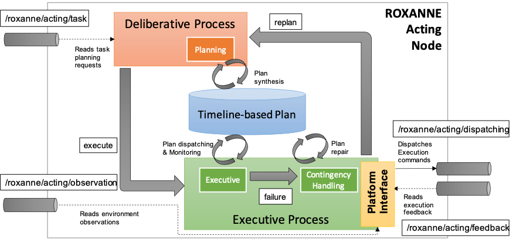

# ROXANNE Acting Node

A ROXANNE node should receive task planning and execution requests, plan a timeline-based plan and carry out the execution of such a plan by **dispatching actions** to other ROS nodes a receiving **execution feedback**. The figure below shows the general organization of a general ROXANNE acting node and its integration into ROS. It shows the internal lifecycle realizing the **goal-oriented acting capabilities** of ROXANNE and the dependencies with the external ROS infrastructures.

A ROXANNE acting node receives task requests on a dedicated input topic.  The internal deliberative process receives the request and start a planning activity aimed at synthesizing a (shared) timeline-based plan. Once a plan has been found, the execution process is notified in order to start the actual execution of the plan. An internal executive process starts monitoring and dispatching the actions of the timeline-based plan through the Platform interface.

The _default behavior_ of an acting node dispatches action execution requests through a dedicated output topic  and receive information from two distinct input topics. Specifically, an input topic  allows the acting node to receive execution feedback about dispatched actions. This is crucial for actions whose successful or failed execution can only be observed at runtime and are not under the control of the acting agent (e.g., robot navigation activities). Another input topic  instead allows the acting node to observe the state of external features that are necessary for the correct execution of the behavior of the agent. For example, the actions of a robot may depend on the availability of a specific type of resource (e.g., a tool shared with the human operator) and thus the robot should know if such a tool is available when it needs it. 

An _execution failure_ is detected every time that an observation or a feedback does not comply with the plan (i.e., the observed state of the environment does not comply with the one expected by the plan). In such a case a (generally domain-dependent) contingency handling procedure is performed to set the system to a stable state and start replanning in order to find (if possible) an alternative way of performing the requested task.

